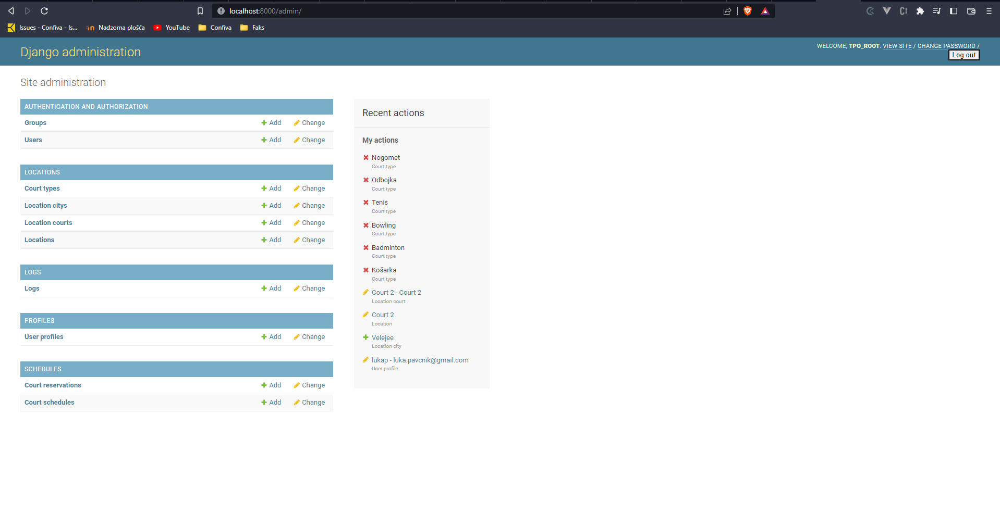
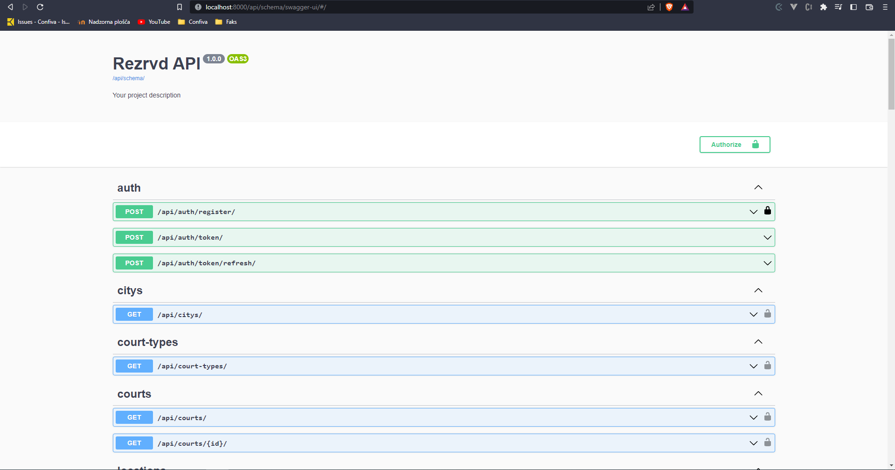
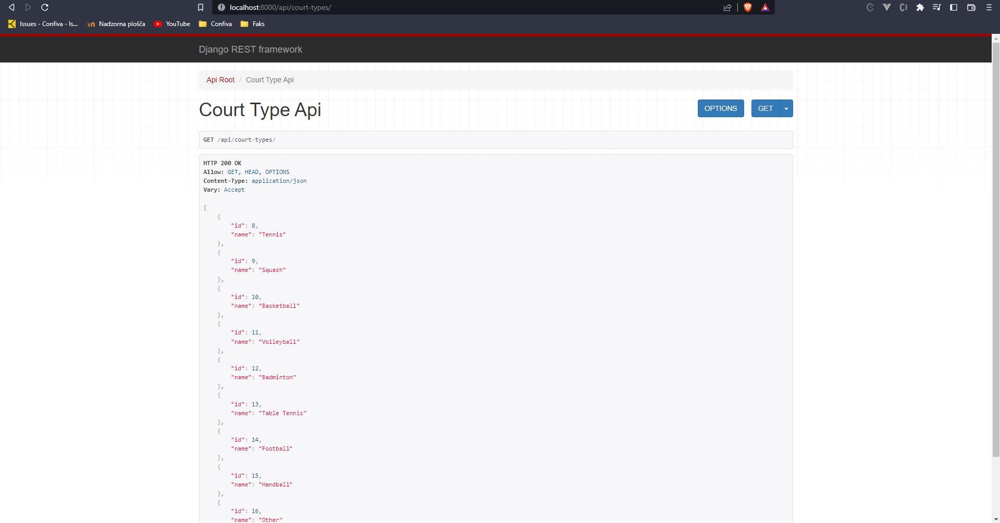
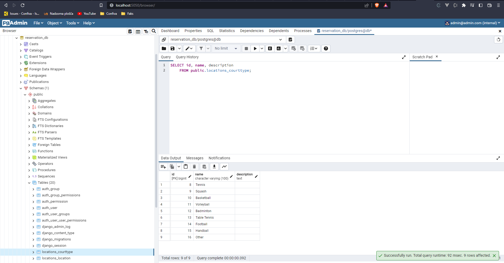
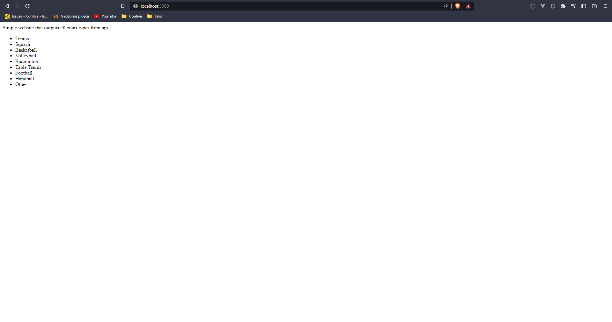

# Tehnicne vescine 2.nal

Ta dokument je namenjen dokumentaciji 2 naloge pri tehničnih veščinah.

# Cilj
Aplikacija je API za rezerviranje igrišč. Za večino API klicev je potrebna avtentikacija z pošiljanjem ACCESS TOKENA, ki je pridobljen z loginu. Ta containerizacija je mišljena samo za lokalni development.

Originalni cilj je bil narediti django rest api z postgres bazo, ker pa rabimo narediti 4 service sem se pa odločil še tudi dodati spletno stran, ki kliče ta api ter postgres admin aplikacijo, kjer lahko direktno upravljamo z bazo, čeprav to večinoma delamo v django admin panelu.

# Volumes

Obstaja samo reservation-volume, ki ga uporabljam za persistentno shranjevanje postgres podatkov baze.

# Storitve

## API

API oziroma django rest api aplikacija, ki je dostopna na localhost:8000, njegove zmogljivosti so:
 - localhost:8000/api/{celotn api url} - izhodiščni API
 - localhost:8000/admin/ - admin plošča djangota, za dostop je potrebno prvo narediti superuserja z "docker exec -it reservation-api python manage.py createsuperuser"
 - localhost:8000/api/schema/swagger-ui/ - API shema

*Django admin plošča*

*Swagger api shema*

*Django api*

### Opis docker-compose
- container_name je reservation-api
- build se zgradi tako, da uporabi svoj Dockerfile v katerem vzame python alpine sliko, nastavi delovno okolje in posodobi/doda potrebne apk pakete, na koncu pa še doda potrebne python pakete iz requirements.txt 
- ports nastavi port 8000 -> 8000
- volumes nastavi trenutni direktorij v /usr/src/app/
- command prvo migrira vse potrebne migracije in nato zažene python strežnik
- env_file nastavi privzet .env file, kjer so nastavljene osnovne nastavitve in podatki za povezavo do postgres streznika
- depends_on db saj potrebuje bazo za pravilno delovanje

## DB

Postgres baza, ki je dostopna na localhost:5432

### Opis docker-compose
 - container_name je reservation-db
 - image je najnovejši postgres
 - restart je always, to pomeni da se bo container vedno resetiral, če se ugasne
 - ports nastavi 5432 -> 5432
 - volumes nastavi reservation-volume v /var/lib/postgresql/data
 - environment nastavi osnovne spremenljivke baze (username, password, database name), ki se kasneje uporabijo za povezovanje iz django

## PGADMIN

Postgres admin plošča, ki je dostopna na localhost:5050, za prijavo login je nastavljen v environment spremenljivkah (admin@admin.com, root), nato lahko dodamo nov strežnik, kjer lahko direktno dostopamo do baze, vsi podatki za dostop so v .env

*Postgres admin*

### Opis docker-compose
 - container_name je reservation-db-pgadmin
 - image je najnovejši pgadmin4
 - restart je always
 - ports nastavi 5050 -> 80
 - environemnt spremenljivke, potrebne za dostopno v admin ploščo (to niso iste za dostop do baze)

## FRONTEND

Frontend je osnovni nginx strežnik, ki servira en osnoven html file, v katerem se naložijo vsa vrsta igrišč preko django apija, torej uporablja url localhost:8000/api/court-types/. Ta spletna stran je samo primer kako lahko dostopamo preko našega APIja, spletna stran za rezervacije, ki jo imamo za projekt je dostopna na https://janezsedeljsak.github.io/reservations-frontend/.

*Simple html*

### Opis docker-compose
 - container_name je reservation-frontend
 - image je najnovejši nginx
 - ports nastavi 3000 -> 80
 - volumes nastavi simpleweb direktorij v /usr/share/nginx/html (iz tu servira datoteke)
 - depends_on api

## Dodatni docker ukazi za razvoj

    # Inštalira pakete iz requirements.txt (koristno pri dodajanju novih paketov)
    docker exec -it reservation-api pip install ./requirements.txt

    # Naredi migracijske datoteke in jih nato migrira (koristno ko spreminjamo django modele in jih rabimo spremeniti tudi v bazi)
    docker exec -it reservation-api python manage.py makemigrations
    docker exec -it reservation-api python manage.py migrate

    # Počisti bazo
    docker exec -it reservation-api python manage.py flush